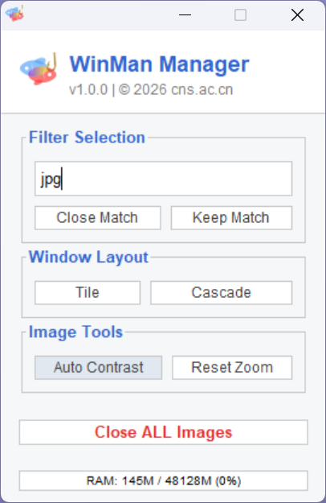

<p align="center">
  
</p>

<h1 align="center">WinMan: Window Manager & Workflow Accelerator</h1>

<p align="center">
  
  
  
  
  <br>
  
  
  <a href="#"></a>
</p>

<p align="center">
  <strong>The Ultimate Workspace Manager for Bioimage Analysis</strong>
  <br>
  <em>Solve the "Desktop Explosion" problem with Smart Filtering, Batch Processing, and Memory Monitoring.</em>
</p>

---

<div align="center">


<br>
<em>(WinMan v1.0.0: Modern Flat UI with Compact Layout)</em>

</div>

## 📖 Overview

**WinMan (Window Manager) v1.0.0** is a lightweight yet powerful utility designed to streamline high-throughput microscopy workflows in ImageJ/Fiji.

Bioimage analysis often involves opening dozens of images, resulting tables, and plots, leading to a cluttered workspace and memory overflows. **WinMan** acts as your digital housekeeper, providing granular control over open windows and system resources with a modern, commercial-grade interface.

### 🚀 What's New in v1.0.0?
* **Modern Flat Design**: A clean, "Stick-supported" compact UI that minimizes screen real estate usage while maximizing usability.
* **Smart "Invert" Logic**: Not just closing windows—WinMan allows you to **KEEP** specific windows (e.g., "Keep only *merged* images") while clearing the rest.
* **Workflow Acceleration**: Batch tools to instantly **Auto-Contrast** or **Reset Zoom** for 50+ open images at once.
* **System Health**: An integrated **Memory Bar** that monitors RAM usage and performs Garbage Collection (GC) on click.

---

## ✨ Key Features

### 1. Smart Filtering Engine
* **Close Match**: Instantly close all windows containing a specific keyword (e.g., remove all `C1-` channels).
* **Keep Match (The Killer Feature)**: The inverse logic. Type `result` and click **Keep Match** to close everything *except* your final results.
* **Safety First**: The "Close ALL" button includes a confirmation dialog to prevent accidental data loss.

### 2. Image Tools (Batch Processing)
* **Auto Contrast All**: Applies an intelligent histogram stretch (`Enhance Contrast, saturated=0.35`) to **ALL** open images instantly. No more clicking `Image > Adjust > Brightness` twenty times.
* **Reset Zoom All**: Resets all windows to 100% zoom level for standardized viewing.

### 3. Layout & System Control
* **Memory Monitor**: A live progress bar at the bottom showing RAM usage (e.g., `2GB / 16GB`).
    * *Action:* Click the bar to force **Garbage Collection** and free up memory immediately.
* **Window Layout**: Improved `Tile` and `Cascade` algorithms to neatly organize your workspace.

---

## 📥 Installation

1.  Download the latest `WinMan-1.0.0.jar` from the [Releases Page](../../releases).
2.  Drag and drop the file into your Fiji/ImageJ **`plugins`** folder (or main window).
3.  Restart Fiji.
4.  Navigate to: `Plugins > Biosensor Tool > WinMan Manager`.

---

## 🎮 Usage Guide

### 1. Filter Logic

| Function | Input Example | Action | Use Case |
| :--- | :--- | :--- | :--- |
| **Close Match** | `.csv` | Closes any window with ".csv" in the title. | Cleaning up intermediate data tables. |
| **Keep Match** | `Final` | Closes everything **EXCEPT** windows with "Final" in title. | Isolating your processed results for export. |
| **Close Match** | `C2-` | Closes all Channel 2 images. | Removing reference channels after alignment. |

### 2. Interface Guide

* **Filter Selection**: Input keywords here. Case-insensitive.
* **Window Layout**:
    * *Tile*: Arranges images in a grid without overlap.
    * *Cascade*: Stacks images diagonally with titles visible.
* **Image Tools**:
    * *Auto Contrast*: Fixes "black" 16-bit images instantly.
* **Status Footer**: Shows operation feedback (e.g., "Closed 12 windows") and Memory usage.

---

## 📚 Technical Stack

WinMan is built with strict adherence to the **CNS Lab Software Standards**:

* **Core**: Java 8 / ImageJ 1.x API (`ij.jar`).
* **UI Framework**: Java Swing with custom `FlatDesign` implementation.
* **Build System**: Maven (SciJava architecture).
* **Compatibility**: Fully compatible with ImageJ and Fiji on Windows, macOS, and Linux.

---

## 📚 Citation

If WinMan helps your daily workflow, please consider starring the repo or citing:

```bibtex
@software{wang_winman_2026,
  author = {Wang, Kui},
  title = {WinMan: A Modern Window Manager and Workflow Accelerator for ImageJ/Fiji},
  version = {v1.0.0},
  year = {2026},
  url = {[https://github.com/kuiwang/WinMan](https://github.com/kuiwang/WinMan)},
  organization = {Chinese Academy of Sciences}
}
```

---

<p align="center">
  <strong>© 2026 Dr. Kui Wang | Chimeric Nano Sensor Team | www.cns.ac.cn</strong>
</p>